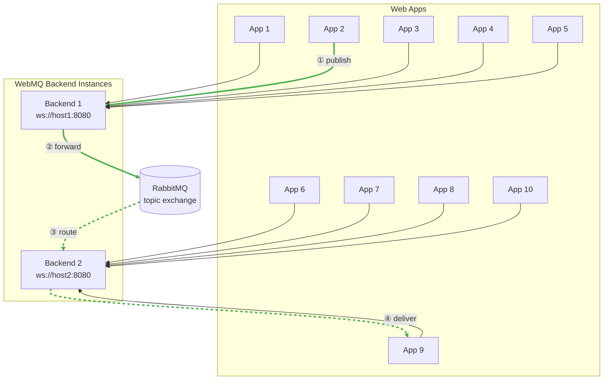
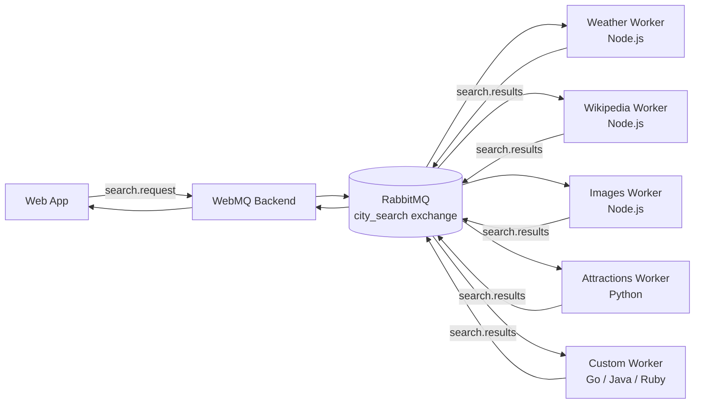
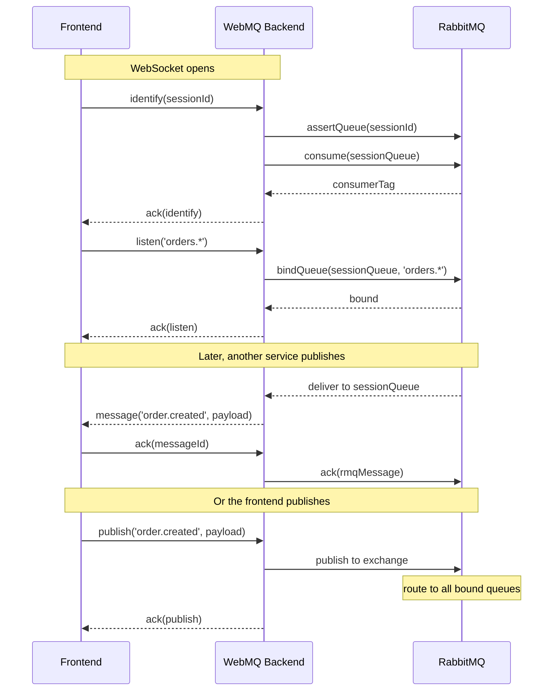

# Architecture

WebMQ bridges WebSocket connections to RabbitMQ topic exchanges. Every frontend client gets a dedicated session queue on RabbitMQ, and messages flow bidirectionally through a single persistent WebSocket.

## How it works

1. A frontend connects to the WebMQ backend via WebSocket
2. The backend creates a RabbitMQ session queue for that connection
3. When the frontend calls `listen('orders.*', cb)`, the backend binds the session queue to the RabbitMQ exchange with binding key `orders.*`
4. When any service (frontend or backend) publishes to `orders.created`, RabbitMQ routes the message to all matching queues
5. The backend reads from the session queue and forwards messages to the frontend via WebSocket

## Topic Routing

RabbitMQ topic exchanges route messages based on routing keys (dot-separated strings) and binding keys (which support wildcards):

- `order.created` — exact match
- `order.*` — matches `order.created`, `order.cancelled`, etc. (single segment)
- `order.#` — matches `order.created`, `order.payment.received`, etc. (multi-segment)
- `#` — matches everything

## Horizontal Scaling

Add more WebMQ backend instances, and your frontends distribute across them. RabbitMQ handles message routing regardless of which backend a client is connected to.

The highlighted path shows a message from **App 2** reaching **App 9** — they're on different backend instances, but RabbitMQ routes it through:

① App2 publishes a message → ② Backend1 forwards to RabbitMQ → ③ RabbitMQ routes to subscribers on Backend2 → ④ Backend2 delivers to App9.

A message published by any frontend reaches any other subscribed frontend or backend service — no matter which WebMQ instance they're connected to. To scale, add more backend instances behind a load balancer.

## Fan-Out to Workers

A single frontend request can trigger work across multiple independent workers, each in a different language. Workers connect directly to RabbitMQ using AMQP — they don't need WebMQ at all.

The frontend publishes a single `search.request` event. RabbitMQ fans it out to every worker bound to that pattern. Each worker processes independently (weather API, Wikipedia, image search, ...) and publishes results back. The frontend receives results as they arrive — real-time, parallel, multi-source.

This is shown in action in the [city-search example](https://github.com/kbairak/webmq/tree/main/examples/city-search) and detailed in the [cross-language workers guide](cross-language.md).

## Bidirectional Flow

Unlike traditional WebSocket setups where only the server pushes to clients, WebMQ lets frontends **publish** and **subscribe** equally:

- **Publish**: Frontend → Backend → RabbitMQ → Backend Services + Other Frontends
- **Subscribe**: Backend Services → RabbitMQ → Backend → Frontend

This symmetry means a React component can publish a "task" event that gets picked up by a Python worker, whose result is routed back to the same or different frontend.

## Session Queues

Each WebSocket connection gets a dedicated auto-delete queue on RabbitMQ, named after the `sessionId`. This queue:

- Receives messages routed to topics the client subscribed to
- Persists messages while the client is disconnected (if queue is still alive)
- Is cleaned up on normal disconnect
- Supports session dedup: if a client reconnects with the same `sessionId`, the old consumer is cancelled and replaced

## Message Flow Detail

1. **Identify**: Frontend sends its `sessionId`. Backend creates/asserts a RabbitMQ queue for that session and starts consuming from it
2. **Listen**: Frontend subscribes to a topic pattern. Backend binds the session queue to the exchange with that pattern
3. **Receive** (async): RabbitMQ delivers messages matching the binding to the session queue. Backend forwards them over the WebSocket and waits for the client to ACK before acknowledging to RabbitMQ
4. **Publish**: Frontend publishes to a routing key. Backend publishes the message to the exchange. RabbitMQ routes it to all matching queues (other clients, workers, backend services)
